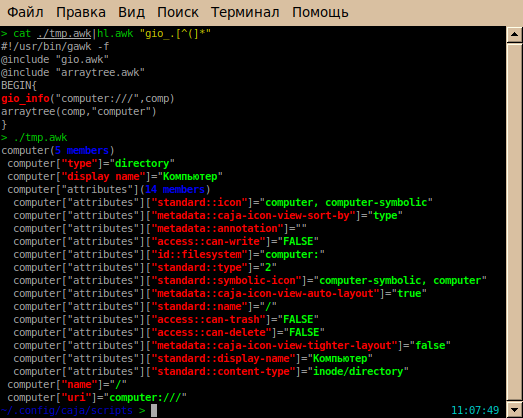
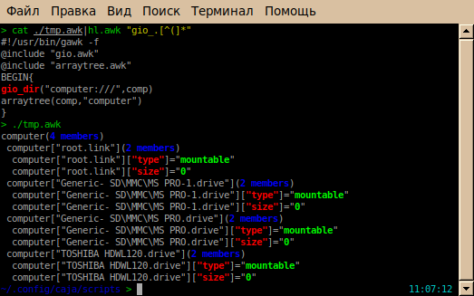

# My awklibs
A small collection of my achievements for awk scripting and programming. Install them to a `/usr/share/awk/` directory and use them in your scripts with command (for example) `@include "arraytree"` (w/o extension) or when running from cmdline: `gawk -i arraytree '{......}'`

The installation command is:
```
sudo cp "library.awk" "$(gawk 'BEGIN{x=ENVIRON["AWKPATH"];gsub(/(\.:|:.*$)/,"",x);print x}')"
```


# [GIO Functions](gio.awk)
GAWK Library for adding functions of converting some various GIO-info about files/locations such as **smb://192.168.8.1/share/photo.jpg** or **computer:///TOSHIBA HDWL120.drive**<br>
installation:<br>
1) Get awk @include library (AWKPATH built-in variable) by running:
```
gawk 'BEGIN{x=ENVIRON["AWKPATH"];gsub(":","\n",x);print x}'
```
2) Choose preferred path from list and create symlink:
```
ln -s gio.awk </chosen/path>
```
or:
```
cp gio.awk </chosen/path>
```
3) Usage:
```
#!/usr/bin/gawk -f
@include "gio.awk"
BEGIN{
gio_dir("computer:///",comp_list_array_all_attributes,"*")
gio_info("computer:///root.link",rootFS_icon_info)
}
```
*Screenshots:*<br>
<br>


## [Array Tree](arraytree.awk)
**[ru] Массив AWK в виде дерева.**<br>
GNU AWK script for exploring contents of a multi-dimensional associative array.<br> Example:

```
#!/usr/bin/gawk
@include "arraytree.awk"
BEGIN{
 arraytree(ENVIRON,"ENVIRON")
}
```
*Screenshot:*<br>


## [INI from/to AWK array](ini.awk)
The full readme for this lib is in the head of `ini.awk` file. This lib reads ini files, ini stdout, and ini multistring variable and convert it to 2D associative awk array.