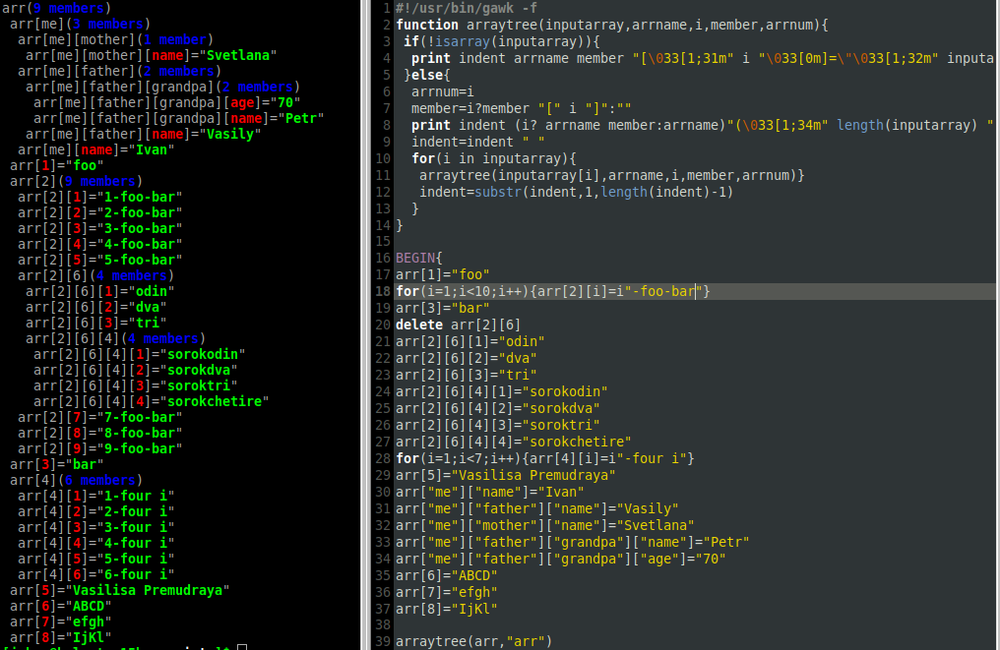

# awklibs
A small collection of my achievements for awk scripting and programming. Install them to a `/usr/share/awk/` directory and use them in your scripts with command (for example) `@include "arraytree"` (w/o extension) or when running from cmdline: `awk -i arraytree '{......}'`

## [Array Tree](arraytree.awk)
**[ru] Массив AWK в виде дерева.**<br>
GNU AWK script for exploring contents of a multi-dimensional associative array.<br> Example:

```
#!/usr/bin/gawk
@include "arraytree.awk"
BEGIN{
 arraytree(ENVIRON,"ENVIRON")
}
```
*Screenshot:*<br>


## [INI from/to AWK array](ini.awk)
The full readme for this lib is in the head of `ini.awk` file. This lib reads ini files, ini stdout, and ini multistring variable and convert it to 2D associative awk array.